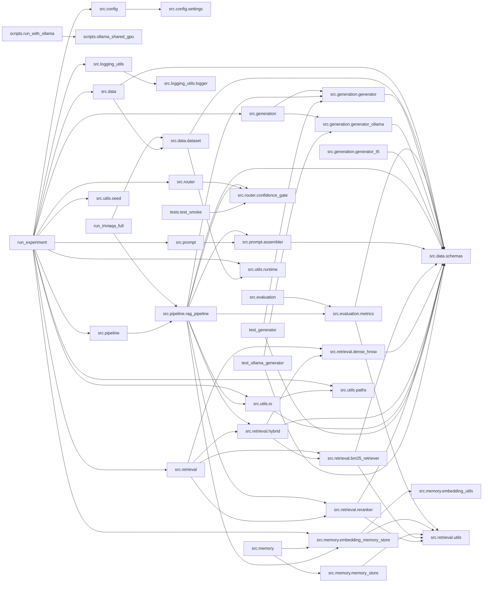

# Codebase Map

This snapshot covers the active main project in the workspace and excludes Kaggle mirrors, generated outputs, and the nested `repo/` copy.

## Structure

```text
PSM_NEW/
├── README.md
├── config.yaml
├── config_gpu_run.yaml
├── config_triviaqa_full.yaml
├── pyproject.toml
├── requirements.txt
├── requirements-py311.txt
├── run_experiment.py
├── run_experiment_gpu.py
├── run_triviaqa_full.py
├── test_generator.py
├── test_ollama_generator.py
├── data/
│   ├── triviaqa_full.jsonl
│   ├── triviaqa_sample.jsonl
├── scripts/
│   ├── build_codebase_map.py
│   ├── monitor_experiment.py
│   ├── ollama_shared_gpu.py
│   ├── prepare_triviaqa_full.py
│   ├── run_with_ollama.py
│   ├── watch_progress.sh
├── src/
│   ├── __init__.py
│   ├── config/
│   │   └── __init__.py
│   │   └── settings.py
│   ├── data/
│   │   └── __init__.py
│   │   └── dataset.py
│   │   └── schemas.py
│   ├── evaluation/
│   │   └── __init__.py
│   │   └── metrics.py
│   ├── generation/
│   │   └── __init__.py
│   │   └── generator.py
│   │   └── generator_ollama.py
│   │   └── generator_t5.py
│   ├── logging_utils/
│   │   └── __init__.py
│   │   └── logger.py
│   ├── memory/
│   │   └── __init__.py
│   │   └── embedding_memory_store.py
│   │   └── embedding_utils.py
│   │   └── memory_store.py
│   ├── pipeline/
│   │   └── __init__.py
│   │   └── rag_pipeline.py
│   ├── prompt/
│   │   └── __init__.py
│   │   └── assembler.py
│   ├── retrieval/
│   │   └── __init__.py
│   │   └── bm25_retriever.py
│   │   └── dense_hnsw.py
│   │   └── hybrid.py
│   │   └── reranker.py
│   │   └── utils.py
│   ├── router/
│   │   └── __init__.py
│   │   └── confidence_gate.py
│   ├── utils/
│   │   └── __init__.py
│   │   └── io.py
│   │   └── paths.py
│   │   └── runtime.py
│   │   └── seed.py
├── tests/
│   ├── test_smoke.py
└── (excluded: kaggle_*, repo/, outputs/, logs/, .venv/)
```

## Core Packages

- src.config: YAML-backed settings loader.
- src.data: dataset loading and schema objects.
- src.evaluation: answer scoring and metrics.
- src.generation: generator backends for T5 and Ollama.
- src.logging_utils: structured logging helpers.
- src.memory: semantic memory store and persistence helpers.
- src.pipeline: end-to-end RAG orchestration.
- src.prompt: prompt assembly.
- src.retrieval: BM25, dense HNSW, hybrid retrieval, reranking.
- src.router: confidence gate for memory-vs-retrieval routing.
- src.utils: IO, runtime, path, and seeding helpers.

## Entry Points

- run_experiment.py: primary main-project runner.
- run_experiment_gpu.py: GPU-oriented variant.
- run_triviaqa_full.py: full TriviaQA runner.
- scripts/*.py: local utilities for monitoring, Ollama, and dataset prep.

## Import Graph



## Refresh

Run `source .venv/bin/activate && python scripts/build_codebase_map.py` from the project root to regenerate this file.
